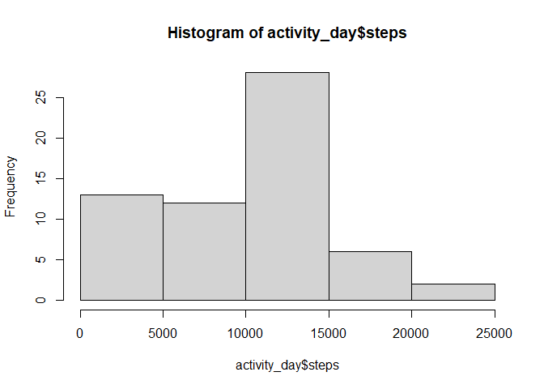
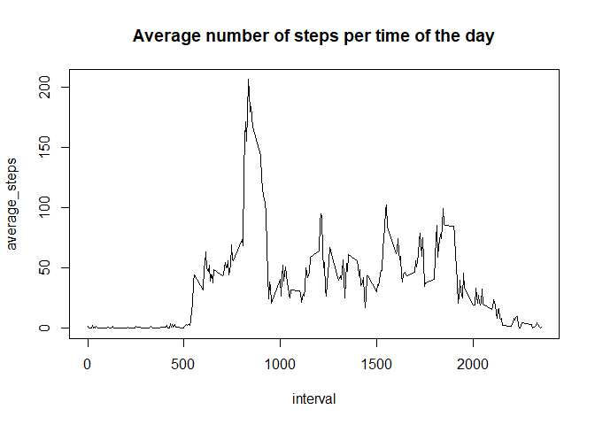
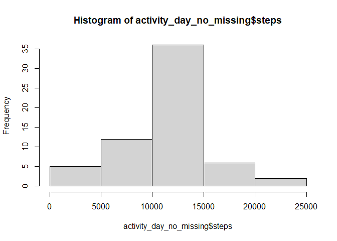
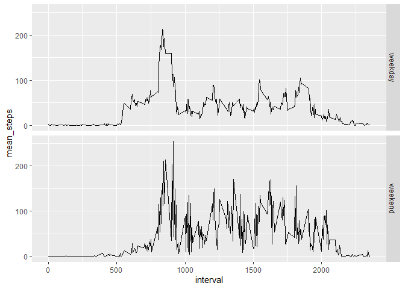

## Loading and preprocessing the data

### Loading libraries and cleaning environment


```r
library(tidyverse)
```

```
## -- Attaching packages --------------------------------------- tidyverse 1.3.1 --
```

```
## v ggplot2 3.3.5     v purrr   0.3.4
## v tibble  3.1.6     v dplyr   1.0.8
## v tidyr   1.2.0     v stringr 1.4.0
## v readr   2.1.2     v forcats 0.5.1
```

```
## -- Conflicts ------------------------------------------ tidyverse_conflicts() --
## x dplyr::filter() masks stats::filter()
## x dplyr::lag()    masks stats::lag()
```

```r
rm(list = ls())
```

### Unzipping file and loading it into R


```r
if(!file.exists("./data/activity.csv"))
  unzip("activity.zip", exdir = "data")

activity <- read_csv("./data/activity.csv")
```

```
## Rows: 17568 Columns: 3
## -- Column specification --------------------------------------------------------
## Delimiter: ","
## dbl  (2): steps, interval
## date (1): date
## 
## i Use `spec()` to retrieve the full column specification for this data.
## i Specify the column types or set `show_col_types = FALSE` to quiet this message.
```

## What is mean total number of steps taken per day?

1. Make a histogram of the total number of steps taken each day


```r
#histogram
activity_day <- activity %>% 
  group_by(date) %>% 
  summarise(
    steps = sum(steps, na.rm = TRUE)
  )

hist(activity_day$steps)
```

<!-- -->

2. Calculate and report the **mean** and **median** total number of steps taken per day


```r
#mean and median
mean_median_day <- activity_day %>% 
  summarise(
    value = "number of steps - raw",
    mean = mean(steps, na.rm = TRUE),
    median = median(steps, na.rm = TRUE)
  )
mean_median_day
```

```
## # A tibble: 1 x 3
##   value                  mean median
##   <chr>                 <dbl>  <dbl>
## 1 number of steps - raw 9354.  10395
```


## What is the average daily activity pattern?

1. Make a time series plot (i.e. `type = "l"`) of the 5-minute interval (x-axis) and the average number of steps taken, averaged across all days (y-axis)


```r
daily_pattern <- activity %>% 
  group_by(interval) %>% 
  summarise(
    average_steps = mean(steps, na.rm = TRUE)
  )

with(daily_pattern, plot(x = interval, y = average_steps, type = "l", main = "Average number of steps per time of the day", ))
```

<!-- -->

2. Which 5-minute interval, on average across all the days in the dataset, contains the maximum number of steps?


```r
daily_pattern %>% 
  filter(average_steps == max(average_steps, na.rm = FALSE))
```

```
## # A tibble: 1 x 2
##   interval average_steps
##      <dbl>         <dbl>
## 1      835          206.
```


## Imputing missing values

1. Calculate and report the total number of missing values in the dataset (i.e. the total number of rows with `NA`s)


```r
total_complete <- complete.cases(activity)
nrow(activity) - sum(total_complete)
```

```
## [1] 2304
```

2. Devise a strategy for filling in all of the missing values in the dataset. The strategy does not need to be sophisticated. For example, you could use the mean/median for that day, or the mean for that 5-minute interval, etc.

In here I will use the mean for that 5 minute interval across all days, which I calculated before


```r
activity_no_missing <- activity

for(i in 1:nrow(activity_no_missing)){
  if(is.na(activity_no_missing$steps[i])){
    activity_no_missing$steps[i] <- 
      as.numeric(daily_pattern[daily_pattern$interval == activity_no_missing$interval[i],2])
  }
}
```


3. Create a new dataset that is equal to the original dataset but with the missing data filled in.

The dataset was created in the previous loop, I will show the head of it


```r
head(activity_no_missing)
```

```
## # A tibble: 6 x 3
##    steps date       interval
##    <dbl> <date>        <dbl>
## 1 1.72   2012-10-01        0
## 2 0.340  2012-10-01        5
## 3 0.132  2012-10-01       10
## 4 0.151  2012-10-01       15
## 5 0.0755 2012-10-01       20
## 6 2.09   2012-10-01       25
```


4.a Make a histogram of the total number of steps taken each day 


```r
#histogram no missing
activity_day_no_missing <- activity_no_missing %>% 
  group_by(date) %>% 
  summarise(
    steps = sum(steps, na.rm = TRUE)
  )

hist(activity_day_no_missing$steps)
```

<!-- -->

4.b
Calculate and report the **mean** and **median** total number of steps taken per day. Do these values differ from the estimates from the first part of the assignment? What is the impact of imputing missing data on the estimates of the total daily number of steps?


```r
mean_median_day_no_missing <- activity_day_no_missing %>% 
  summarise(
    value = "number of steps - no_missing_values",
    mean = mean(steps, na.rm = TRUE),
    median = median(steps, na.rm = TRUE)
  )

summary <- rbind(mean_median_day,mean_median_day_no_missing)
summary
```

```
## # A tibble: 2 x 3
##   value                                 mean median
##   <chr>                                <dbl>  <dbl>
## 1 number of steps - raw                9354. 10395 
## 2 number of steps - no_missing_values 10766. 10766.
```
As we can see, the impact of the strategy I took for imputing missing values causes both the mean and the median to increase, and actually to be the same.


## Are there differences in activity patterns between weekdays and weekends?

1. Create a new factor variable in the dataset with two levels -- "weekday" and "weekend" indicating whether a given date is a weekday or weekend day.

For this part I use the "with no missing" dataset, I change locale as I am in a Spanish computer


```r
curr_locale <- Sys.getlocale("LC_TIME")
Sys.setlocale("LC_TIME", "English")
```

```
## [1] "English_United States.1252"
```

```r
activity_no_missing <- activity_no_missing %>% 
  mutate(
    weekday = weekdays(activity_no_missing$date)
  ) %>% 
  mutate(
    weekday = if_else(weekday == paste(c("Sunday","Saturday"), sep = "|"),"weekend","weekday"))
  
activity_no_missing$weekday <- as.factor(activity_no_missing$weekday)

Sys.setlocale("LC_TIME",curr_locale)
```

```
## [1] "Spanish_Argentina.1252"
```

```r
str(activity_no_missing)
```

```
## tibble [17,568 x 4] (S3: tbl_df/tbl/data.frame)
##  $ steps   : num [1:17568] 1.717 0.3396 0.1321 0.1509 0.0755 ...
##  $ date    : Date[1:17568], format: "2012-10-01" "2012-10-01" ...
##  $ interval: num [1:17568] 0 5 10 15 20 25 30 35 40 45 ...
##  $ weekday : Factor w/ 2 levels "weekday","weekend": 1 1 1 1 1 1 1 1 1 1 ...
```

1. Make a panel plot containing a time series plot (i.e. `type = "l"`) of the 5-minute interval (x-axis) and the average number of steps taken, averaged across all weekday days or weekend days (y-axis).


```r
daily_pattern_weekdays <- activity_no_missing %>% 
  group_by(weekday, interval) %>% 
  summarise(
    mean_steps = mean(steps)
  )
```

```
## `summarise()` has grouped output by 'weekday'. You can override using the
## `.groups` argument.
```

```r
qplot(x = interval, y = mean_steps, data = daily_pattern_weekdays, facets = weekday~., geom = "line")
```

<!-- -->

